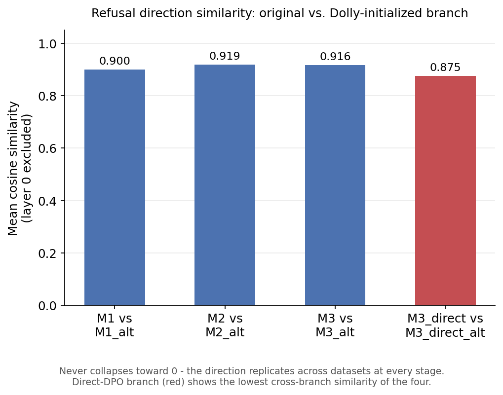
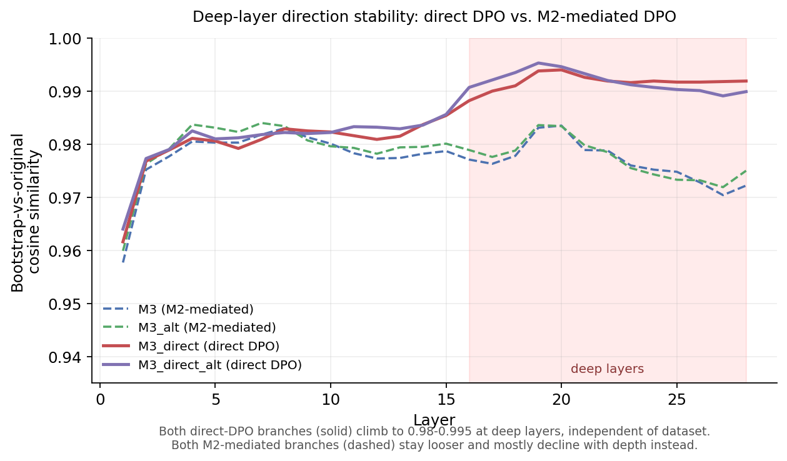

# Where Does Safety Live? Tracing a Refusal Direction from Base Model to DPO

*A mechanistic study of SFT and DPO on Qwen2.5-1.5B, replicated across two independent training datasets.*

We trained a 1.5B model through four stages — base → generic SFT → safety
SFT → DPO — and tracked a single internal direction associated with refusal
at every step. Then we did it again, starting from a different, independent
instruction-tuning dataset, to see if the story survives. Short version: DPO
looks like it's mostly turning up the volume on a direction that's already
there by the time generic instruction-tuning finishes, not building
something new from scratch. That held up on a second dataset. What didn't
hold up cleanly is *how* that direction gets organized depending on which
training path got you there — and that turned out to be more interesting
than I expected going in.

---

## The question

Does safety training give a model genuinely richer internal representations
of harm, or does it mostly reshape how an existing, already-formed direction
gets hooked up to behavior? Put differently: is there a real difference
between a model that "understands" harm and one that's just gotten better at
routing a pre-existing signal to a refusal?

To test this without just asking the model, I built a controlled eval set
with four quadrants — crossing *actually harmful* against *worded
harmful-sounding*:

|                       | **Worded harmful-sounding**                          | **Worded neutrally**                                          |
|-----------------------|-------------------------------------------------------|-----------------------------------------------------------------|
| **Actually harmful**  | **A** — obviously harmful (HarmBench, n=50). Correct response: refuse. | **C** — harmful, disguised (hand-curated, n=20). Correct response: refuse. Sharpest test of real understanding. |
| **Actually benign**   | **B** — sounds risky, isn't (XSTest, n=250). Correct response: comply. Classic over-refusal trap. | **D** — benign, plainly worded (Alpaca, n=50). Correct response: comply. |

Quadrant C is the whole point of this design: a model relying on surface
wording will do fine on A, B, and D but should struggle here. A model that
actually tracks intent shouldn't.

---

## Setup, briefly

**Training chain** (Qwen2.5-1.5B, LoRA r=64 throughout — flagging that
constraint up front, see Limitations): M0 (base) → M1 (SFT on Alpaca) → M2
(SFT on PKU-SafeRLHF *chosen* responses) → M3 (DPO on the *same*
PKU-SafeRLHF prompts, matched chosen/rejected pairs). M2 and M3 sharing
identical prompts and differing only in objective is what lets me separate
"DPO as a method" from "DPO's training data." A second path, **M3_direct**,
applies DPO straight to M1, skipping M2 — isolates whether DPO's effect
depends on the model already having been through safety-SFT.

**The replication branch**: M1's data is the thing I was least sure about.
Alpaca is generated by `text-davinci-003` — an already-aligned model — so
any safety-flavored style in M1 could in principle be inherited from
Alpaca's generator rather than being a real property of instruction-tuning.
So I trained a second, parallel chain (`_alt` suffix) identical in every way
except M1_alt is trained on
[Dolly-15k](https://huggingface.co/datasets/databricks/databricks-dolly-15k)
— human-written from scratch, no aligned-LLM generation step. M2_alt/M3_alt/
M3_direct_alt keep training on the same PKU-SafeRLHF data as the original —
the only variable that changes is which dataset produced M1.

**Refusal direction**: diff-in-means, mean(activation | quadrant A) −
mean(activation | quadrant D), per layer per stage, unit-normalized. Same
core method as Arditi et al. (2024, NeurIPS).

Full methodology (causal ablation, steering, bootstrap procedures, the
LoRA-subspace check) is in `CLAUDE.md`, kept out of here to keep this
readable.

---

## Finding 1: the representation shows up before the behavior does

M1 — generic instruction-tuning, *before any safety training at all* —
already has probes flagging 85% of quadrant C as unsafe internally, despite
0% behavioral soft-deflection at that stage. The model has something
resembling the relevant representation well before it does anything
differently in its outputs.

The direction itself moves most during this same stage. Mean drift (1 −
cosine similarity) across 28 layers: M0→M1 ≈ 0.335, M1→M2 ≈ 0.040, M2→M3 ≈
0.070. Whatever DPO is doing, it's adding on top of something mostly already
built during plain instruction-tuning, not building it from scratch.

---

## Finding 2: this replicates on a second, independent dataset

<p align="center"></p>

Training M1 on Dolly instead of Alpaca gives a direction that stays highly
similar to the original at every stage — never below 0.875, mostly in the
0.90–0.92 range. I want to be precise about what this does and doesn't show:
it's evidence the direction isn't specific to Alpaca, replicated across the
two datasets I actually tried. That's meaningfully weaker than "a general
property of instruction-tuning," which would need more than two datasets to
back up. But it's real support against the concern that this whole project
was reporting an artifact of one dataset's quirks.

---

## Finding 3: the training path matters more than I expected

<p align="center"></p>

This is the result I didn't see coming, and it's the strongest new thing in
this update. Bootstrap resampling (B=1000) shows M3_direct and
M3_direct_alt — the two direct-DPO branches, on *different* datasets — both
settle into a tight 0.98–0.995 cosine-similarity band at layers 16–28. Every
M2-mediated stage, on both datasets, stays looser (roughly 0.94–0.98) and
generally gets *less* stable with depth, not more.

That's a pattern that showed up independently in two separate training
runs, which is what a real replication is supposed to look like. One
precision worth holding onto: "bootstrap-stable" means the *estimate* of the
direction is less sensitive to which prompts get resampled — it's evidence
the underlying computation is more concentrated, but it doesn't by itself
prove a cleaner causal circuit. That would need its own test (see Next
Steps).

There's a second piece that fits the same shape. Cross-branch similarity
actually rises slightly from M1 (0.900) to M2 (0.919), stays close at M3
(0.916), and drops for the direct-DPO branch (M3_direct: 0.875, the lowest
of the four). Safety-SFT looks like it pulls the two branches' representations
closer together; skipping it doesn't. I'm calling this a pattern, not a
finding yet — the gap between 0.900 and 0.919 is two point estimates, and I
haven't tested whether it's bigger than resampling noise. That's the first
thing on my list below.

A third, independent signal points the same direction: using each layer's
effect size for separating *actually harmful* (A+C) from *just surface
wording* (B+D), M2 and M3 both peak at layer 9 — notably shallow. M2_alt and
M3_alt both peak at layer 16, a consistent 7-layer gap. M3_direct (13) and
M3_direct_alt (14) land close together regardless of dataset. So this
property is dataset-sensitive on the M2-mediated path, and close to
dataset-robust on the direct path — same shape as the stability result.
Worth flagging: this is each stage's single best layer, not a layer with a
confidence interval around it, so some of that 7-layer gap could be argmax
noise. Second thing on my list below.

---

## The honest null results

I'd rather own these clearly than bury them.

**Steering didn't confirm the causal story.** Causal ablation shows the
direction is *necessary* for refusal — remove it, refusal collapses.
Steering was supposed to show it's *sufficient* — add it, refusal should
appear. It hasn't, cleanly. Adding the direction across 15 layers at once
collapses output into near-total degenerate text (98%) instead of inducing
refusal, most likely from the addition compounding across that many
simultaneous residual-stream injections. A single-layer version produced a
small, non-significant shift (p=0.50) — but at layer 21, which sits outside
the 24–28 range ablation actually found sufficient, so that test may have
been aimed at the wrong layer as much as it tested the mechanism. A
reworked, configurable version of the experiment exists
(`eval_steering_v2.py`, defaults to a layer inside the validated range) but
hasn't been run yet.

**90%+ of the direction's norm lies outside the LoRA subspace it was trained
through.** Rules out "this is just what a rank-64 adapter happened to be
capable of writing" as the main story — but the overlap that does exist is
real (3–10 standard deviations above a random-direction baseline) and
concentrated exactly where DPO's rotation concentrates. Not primarily a LoRA
artifact, not fully independent of it either.

**Quadrant C's behavioral gap between branches doesn't clear significance.**
M3 70% soft-deflection [95% CI 48–86%] vs. M3_alt 55% [34–74%]; M3_direct
55% [34–74%] vs. M3_direct_alt 30% [15–52%]. Both point the same direction
(alt branch soft-deflects less on disguised harm), and that consistency
across two independent paths is worth noting — but with n=20 and
overlapping CIs in both cases, this is a hypothesis, not a confirmed
difference. The mirror pattern on quadrant A (n=50, tighter CIs — alt models
refuse *more* on overtly-worded harm) is more trustworthy given the larger
sample. Together they suggest something worth checking properly: maybe the
alt branch leans more on surface wording and less on recognizing disguised
intent. That's a real possibility, not something the current data confirms.

---

## Open questions / what I'd want feedback on

- Does the deep-layer stability difference (Finding 3) actually survive a
  formal paired comparison, or is some of it noise from comparing two
  descriptive ranges? I think it will, given how tight the direct-DPO band
  is, but I haven't run the test yet.
- Is "safety-SFT homogenizes cross-dataset representations" a real
  mechanism, or is there a simpler explanation (e.g. M2 initialization
  reducing variance generically, independent of anything about
  homogenization specifically)? Genuinely unsure.
- If someone ran an SAE on this model, would "refusal" split into several
  correlated but distinct features (apology, policy-citation, moralizing,
  topic-flagging)? Ablation would still show the *bundle* is causally
  load-bearing either way, so I don't think this threatens the causal
  result — but it might change what "the direction" actually means.

---

## Next steps, in priority order

Cheapest and most load-bearing first — all three below are pure statistics
on data already collected, no GPU required:

1. **Bootstrap the difference** in cross-branch similarity between the
   M2-mediated and direct-DPO paths directly, instead of eyeballing two
   ranges.
2. **Report a distribution over near-optimal bottleneck layers**, not just
   the single argmax, to check how much of the 9-vs-16 gap is real vs.
   argmax noise.
3. **A formal paired comparison of the deep-layer stability distributions**
   between direct-DPO and M2-mediated branches — turns "these ranges look
   different" into an actual tested claim.

Then, roughly by cost:

4. **Run the redone steering experiment** inside the ablation-validated
   layer range, with a quadrant-A side-effect check included. Closes the
   sufficiency gap in the causal story.
5. **Quadrant C, properly powered.** This is the highest-reward, most
   bounded next experiment, and I'm committing to it, not deprioritizing it:
   n=20 is the thing standing between "directionally interesting" and "an
   actual result" for the most important behavioral comparison in this
   whole project. [StrongREJECT](https://github.com/alexandrasouly/strongreject)
   (Souly et al., 2024 — 313 human-curated, category-labeled harmful
   prompts, specifically built to be less templated than AdvBench) is a
   real, already-vetted seed corpus: the task becomes rewording an
   already-published harmful request into neutral phrasing, not inventing
   harmful intent from nothing. Target: 100+ items, multiple harm
   categories, several paraphrase variants each.
6. Full fine-tuning robustness check (removes the LoRA-rank confound) —
   expensive, aspirational.
7. Diagnose the steering degenerate-collapse mechanism directly by tracking
   residual-stream norm growth layer-by-layer during generation.

---

## Limitations

1. **LoRA, quantified, not fully resolved.** 90%+ of the direction's norm
   sits outside the rank-64 subspace, but real above-chance alignment exists
   at deep layers. A full-fine-tuning check would add confidence.
2. **Single diff-in-means direction.** Other orthogonal safety-relevant
   directions may exist; not searched for (see Open Questions).
3. **Ablation shows necessity, not yet sufficiency** — steering hasn't
   confirmed the complementary direction cleanly (see Next Steps #4).
4. **Quadrant C, n=20** — the sharpest behavioral test is also the
   least-powered one (see Next Steps #5).
5. **1.5B scale.** Not claimed to generalize to frontier models.
6. **The Alpaca-artifact concern is substantially, not fully, addressed.**
   Reproducibility across Alpaca and Dolly is real evidence, but it's two
   datasets, one model family, one LoRA setup.
7. **The new cross-branch claims need a formal statistical pass** before
   I'd call them settled — see Next Steps #1–3.
8. **Why multi-layer steering collapses to degenerate output** isn't
   independently diagnosed, just hypothesized (residual-stream compounding).

---

## Repo map

Training and analysis are orchestrated through
`colab_unified_training.ipynb` / `colab_unified_analysis.ipynb` and
`src/training/stage_registry.py` — one notebook per task, not one per
model. `src/reproduce.py` runs whatever's CPU-feasible locally;
`src/export_results.py` packages `results/` into a clean, checksummed
folder for moving between machines. Full command reference, current status,
and working conventions live in `CLAUDE.md`.

```bash
python -m venv .venv && source .venv/bin/activate
pip install -r requirements.txt
pytest tests/ -v
```

---

## How to Cite

```bibtex
@misc{dpo_safety_representations,
  title={Where Does Safety Live? Tracing a Refusal Direction from Base Model to DPO},
  author={[Uroš Savurdić]},
  year={2026},
  howpublished={\url{https://github.com/urosavurdic/dpo-safety-representations}},
  note={Independent research project, not peer-reviewed}
}
```